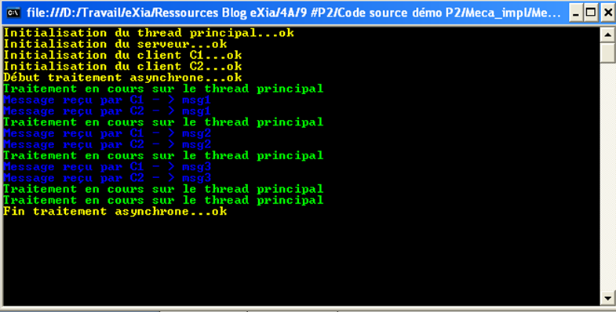

# Workshop Exercise: Threading and Synchronization Techniques
This document outlines a series of exercises designed to explore various threading and synchronization techniques in C#.

## Overall Objective:

Apply the concepts of threading and synchronization mechanisms to solve practical problems in a multithreaded environment.

**Technical Objectives:**

1. [x] 1. Implement delegates
2. [x] 2. Implement lambda expressions
3. [x] 3. Implement anonymous types
4. [x] 4. Implement threads (including parameterized threads)
5. [x] 5. Implement thread pools
6. [ ] 6. Implement asynchronous delegates and callback procedures
7. [ ] 7. Implement events
8. [ ] 8. Implement mutexes
9. [ ] 9. Implement monitors
10. [ ] 10. Implement semaphores
11. [ ] 11. Implement readerWriterLockSlim

Duration: 6 hours

Version: 1.0

## Exercises:

### Q1 - Delegate:

Create a delegate named MyDelegate that takes two integers as arguments and returns their sum.
```C#
public delegate int MyDelegate(int v1, int v2);
```
### Q2 - Lambda Expression:

Construct a lambda expression that calculates the square of a number.

```C#
Func<int, int> square = x => x * x;
```
### Q3 - Anonymous Type:

Implement an anonymous type with an integer and a string property, and demonstrate its usage.

```C#
var person = new { Name = "John Doe", Age = 30 };
Console.WriteLine($"Name: {person.Name}, Age: {person.Age}");
```
### Q4 - Thread & Thread Param:

#### A. Non-Static Class:

Create a class CLpara with a non-static method methode_para that sleeps for 1 second and displays a message 10 times.
Use a thread with a delegate of your creation to launch methode_para.
#### B. Static Class:

Repeat the same exercise using a static class CLpara.

#### C. Lambda Expression:

Repeat the exercise using a lambda expression instead of a class.

#### D. Parameterized Thread:

Modify the code to create a thread that takes an argument ("Hi") and displays it in the console using a lambda expression.

```csharp
Console.WriteLine("Q4 - =======Thread & Thread Param=======");
Console.WriteLine();

ParameterizedDelegate parameterizedDelegate = (Object message) =>
{
    for (int i = 0; i <= 9; i++)
    {
        Thread.Sleep(1000);

        Console.WriteLine("      " + message + " #" + (i + 1));
    }
};

String str = "Hi";

ParameterizedThreadStart threadStartDelegate = new ParameterizedThreadStart(parameterizedDelegate);
Thread thread = new Thread(threadStartDelegate);

thread.Start(str);
thread.Join();

Console.WriteLine();
Console.WriteLine("Q4 - ==============END=============");
```

### Q5 - Pool Threads:

Create a delegate that invokes a lambda expression to:
Retrieve an object as an argument.
Unbox the argument to a string variable named msg.
Display the message, iteration round, and sleep for 1 second in a loop (10 times).
Create three parameterized threads t1, t2, and t3.
Place the threads in a thread pool using an anonymous method and start them with their respective method names.

**💻 [related commit](https://github.com/sikatikenmogne/concurency-workshop-c-sharp/commit/75aeaf055b62a29c0e7057fdeb30733ca8690ad7)**

### Q6 - Delegate Async:

#### A. Delegate Definition:

Create a delegate with the same functionality as Q5, but named using the BeginInvoke method.

#### B. BeginInvoke Method:

The BeginInvoke method will receive:
- An object to encapsulate the thread name (e.g., "T1").
- The delegate itself.
- A lambda expression as a callback.

#### C. Callback:

The callback will:
- Cast the argument received via the lambda statement to retrieve the delegate.
- Call the EndInvoke method on the delegate.
- Display "callback" in yellow on the console.

#### D. Main Thread Waiting:

The main thread will wait until the asynchronous result is completed.
While waiting, it will display "The main thread is waiting for the call back end" every 2 seconds.
When the async result is completed, it will display "callback end" in red on the console.
### Q7 - Event:

#### A. Code Analysis:

Observe the provided code and understand its functionality.

```csharp
using System; 
using System.Collections.Generic; 
using System.Linq; 
using System.Text; 
 
namespace NS_MAIN 
{ 
    class Program 
    { 
        private delegate void DELG(object o); 
        static void Main(string[] args) 
        { 
            Console.ForegroundColor = ConsoleColor.Yellow; 
            Console.WriteLine("Initialisation du thread principal...ok"); 
            DELG delg; 
            NS_SERVER.CLserver server = new NS_SERVER.CLserver(); 
            NS_CLIENT.CLclient client1 = new NS_CLIENT.CLclient(server, "C1"); 
            NS_CLIENT.CLclient client2 = new NS_CLIENT.CLclient(server, "C2"); 
            string[] messages = {"msg1","msg2","msg3"}; 
            delg = (o) => 
                { 
                    for (int i = 0; i < messages.Length; i++) 
                    { 
                        server.Msg = messages[i]; 
                        System.Threading.Thread.Sleep(4000); 
                    } 
                }; 
            Console.WriteLine("Début traitement asynchrone...ok"); 
            IAsyncResult asr = delg.BeginInvoke(((object)("nostate")), 
                (asR)=> 
                { 
                    delg.EndInvoke(asR); 
                    Console.ForegroundColor = ConsoleColor.Yellow; 
                    Console.WriteLine("Fin traitement asynchrone...ok"); 
                },delg); 
            while (!asr.IsCompleted) 
            { 
                Console.ForegroundColor = ConsoleColor.Green; 
                Console.WriteLine("Traitement en cours sur le thread principal"); 
                System.Threading.Thread.Sleep(3000); 
            } 
            Console.Read(); 
        } 
    }   
}
```

#### B. Display Observation:

Describe the expected output of the code.



#### C. Class Implementation:

Create the CLclient and CLserver classes to achieve the same output as observed in point B.

### Q8 - Synchronization:

Implement a mechanism that controls access to objects using a single-threaded object lock. This ensures only one thread can access a critical section at a time.

Identify the critical section (code block) to protect.
Implement the appropriate synchronization mechanism (e.g., lock) to control access.
Demonstrate the use of this mechanism with two threads ("T1" and "T2") accessing the critical section.
### Q9 - Synchronization:

Implement a mechanism that grants exclusive access to a shared resource using a core synchronization primitive. Only one thread can access the resource at a time.

Identify the code block to protect.
Choose the appropriate core synchronization mechanism (e.g., semaphore).
Implement the mechanism and demonstrate its use with two threads ("T1" and "T2") accessing the shared resource.
### Q10 - Synchronization:

Control access to a resource pool using a core synchronization mechanism. Threads entering the pool decrement a counter, and releasing the pool increments it. When the counter reaches zero, new requests are blocked until other threads release the pool.

Identify the resource pool and the maximum access count.
Choose the appropriate core synchronization mechanism (e.g., semaphore).
Implement the mechanism and demonstrate its use with two threads having maximum access and three competitor threads.
### Q11 - Synchronization:

Protect a resource read by multiple threads and written by one thread at a time. Implement a mechanism that allows:

Multiple threads in read mode.
One thread in write mode with exclusive access.
One thread in read-to-upgrade mode that can transition to write mode without losing read access.
Identify the critical sections for reading and writing.
Choose the appropriate synchronization mechanism (e.g., ReaderWriterLockSlim).
Implement the mechanism with four threads:
Two in read mode.
Two in write mode (one initializes an array with odd values, the other with even values).
